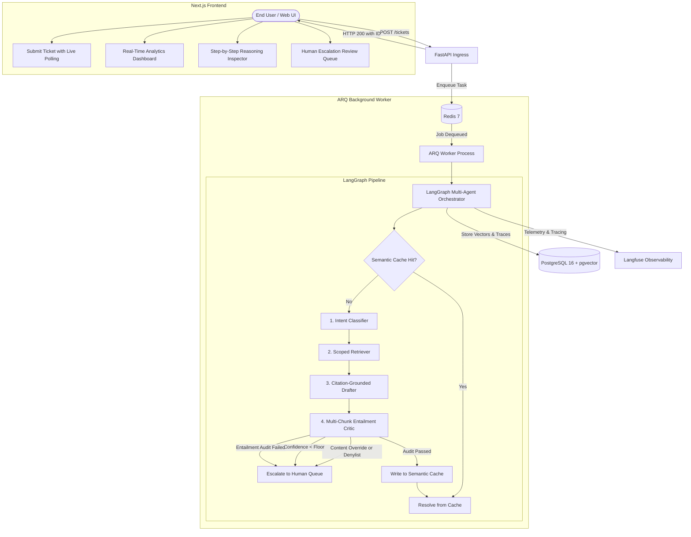

# Support-Loop: AI Ticket Triage & Resolution Agent

[](https://www.python.org/)
[](https://fastapi.tiangolo.com/)
[](https://nextjs.org/)
[](https://github.com/pgvector/pgvector)
[](https://redis.io/)
[](#safety-architecture--the-two-part-narrative)
[](#cost-constraint--0month-architecture)

An enterprise-grade, asynchronous customer support triage and resolution platform engineered with strict reliability, safety, and observability guarantees on a **$0/month free-tier architecture**.

---

## Benchmark Highlights (Golden Eval Set: 54 Rows)

Evaluated against `docs/eval_set.csv` (covering all 10 customer support intents, adversarial queries, edge cases, and policy boundary conditions) under a strict 32.0s pacing limit (8,000 TPM binding constraint):

| Metric | PRD Target | Achieved Result | Evaluation Verdict |
| :--- | :--- | :--- | :--- |
| **Combined Accuracy** | $\ge 75.0\%$ | **88.89%** (48 / 54) | **PASSED (+13.89%)** |
| **Wrongly Auto-Resolved (Safety Misses)** | $\le 5.0\%$ | **0.00%** (0 / 54) | **PASSED (Zero Safety Misses)** |
| **Factual Faithfulness** | Zero Uncited Claims | **100% Citation Grounded** | **Zero Hallucinations** |
| **Average Cost per Ticket** | $\le \$0.01$ | **$0.000794** | **12× Under Budget** |
| **Average End-to-End Latency** | $< 5,000\text{ms}$ | **2,474ms** | **2× Faster than SLA** |

> **Zero-Hallucination Guarantee**: Across all 54 benchmark rows, every auto-resolved answer was verified by an entailment critic against retrieved knowledge base chunks before dispatch. Zero answers contained ungrounded or fabricated claims, including tickets initially categorized as safety misses prior to policy tuning.

---

## Safety Architecture & The Two-Part Narrative

### Part 1: Grounding Quality vs. Intent-Level Risk
Confidence scores and citation entailment measure **grounding quality**—whether a drafted response is factually faithful to the retrieved documentation. However, our benchmark data surfaced that factual grounding alone does not guarantee a ticket is safe to auto-resolve:
1. **Active Software Defects**: A customer reporting *"I don't know how to inform of sign-up errrors"* was matched to standard sign-up instructions. The draft was strictly entailed by the KB, but an informational article cannot fix an active platform bug.
2. **Account Enumeration & Abuse**: Requests stating *"getting error email already in use"* were answered with valid self-service instructions. While factually accurate, auto-responding to such patterns poses account-enumeration and credential-stuffing risks.

Grounding audits alone cannot detect whether a ticket represents a bug report or security risk rather than a self-service inquiry.

### Part 2: Content-Based Overrides & Acknowledged v1 Tradeoffs
To close this gap without raising confidence thresholds to levels that would break legitimate operational self-service (e.g. routine SSH or OOM diagnostics), we introduced **pre-entailment content overrides** in the critic:
- **Registration Abuse Override**: Escalates `registration_problems` tickets matching security-sensitive phrases (`"already in use"`, `"existing account"`, `"captcha"`, `"verification failed"`).
- **Defect/Bug-Report Override**: Escalates tickets expressing bug-reporting phrasing (`"how to report"`, `"how to inform of"`, `"getting an error"`, `"keeps failing"`).

#### Known v1 Tradeoffs:
- **Phrase-Matching Brittleness**: These overrides rely on exact substring matching rather than semantic intent analysis. They will miss novel paraphrases (e.g. *"that email's already got an account on it"*) and may over-fire on benign, routine inquiries containing matching substrings.
- **Intentional Bias toward Safe Escalation**: We deliberately accepted the tradeoff of occasional safe-but-costly over-escalation on known phrasings rather than allowing security or software defects to auto-resolve.
- **Future v2 Iteration**: Natural language classification trained specifically on defect detection vs. informational inquiries represents the next structural evolution.

---

## System Architecture



---

## Multi-Agent Decision Pipeline

1. **Intent Classifier (`classifier.py`)**: Categorizes input into one of 10 standard support intents using structured Pydantic models.
2. **Semantic Cache & Scoped Retriever (`retriever.py`)**: Computes embeddings via `all-MiniLM-L6-v2` (384d) and queries only domain-scoped markdown chunks in `pgvector`.
3. **Citation-Grounded Drafter (`drafter.py`)**: Drafts responses strictly using retrieved context. Every claim must cite a chunk ID; abstains if context is insufficient.
4. **Entailment Critic (`critic.py`)**:
   - **Check 0**: Content-based overrides (abuse patterns, bug reports).
   - **Check 1**: Hard policy denylist (`delete_account`, `complaint`).
   - **Check 2**: Confidence floor (`0.9` for infrastructure & registration; `0.7` general).
   - **Check 3**: Multi-chunk LLM entailment check across all cited passages.

---

## Cost Constraint & $0/Month Architecture

This system runs completely on free-tier infrastructure with automatic failover:

| Component | Technology | Free Tier Provider | Active Model |
| :--- | :--- | :--- | :--- |
| **Primary LLM** | Groq API | console.groq.com | `openai/gpt-oss-20b` |
| **Fallback LLM** | Google AI Studio | aistudio.google.com | `gemini-3.6-flash` |
| **Embeddings** | SentenceTransformers | Local Container | `all-MiniLM-L6-v2` |
| **Relational & Vector DB** | PostgreSQL 16 | Docker / Local | `pgvector/pgvector:pg16` |
| **Task Queue & Cache** | Redis 7 | Docker / Local | `redis:7-alpine` |

---

## User Interface & Features

- **Ticket Submission (`/submit`)**: Real-time progress tracker polling the ARQ worker every 1.2s through pipeline stages.
- **Trace Inspector (`/tickets/[id]`)**: Step-by-step reasoning inspector showing prompts, responses, token usage, latency, and costs per stage.
- **Escalation Queue (`/queue`)**: Human-in-the-loop triage queue for tickets flagged by safety denylists, thresholds, or entailment audits.
- **Analytics Dashboard (`/dashboard`)**: Live KPI metrics, resolution rates, and dynamic provider cost breakdowns.

---

## Quickstart & Local Setup

### 1. Prerequisites
- Docker & Docker Compose
- Groq API Key (free at [console.groq.com](https://console.groq.com))
- Google Gemini API Key (free at [aistudio.google.com](https://aistudio.google.com))

### 2. Environment Configuration
```bash
cp .env.example .env
# Edit .env and supply your keys:
# GROQ_API_KEY=gsk_...
# GEMINI_API_KEY=AIza...
```

### 3. Launch Services
```bash
docker compose up -d --build
```
- **Backend API & Swagger**: [http://localhost:8000/docs](http://localhost:8000/docs)
- **Frontend Dashboard**: [http://localhost:3000](http://localhost:3000)

### 4. Ingest Knowledge Base & Run Tests
```bash
# Ingest markdown knowledge base into pgvector
docker compose exec backend python scripts/seed_kb.py

# Run unit and integration tests
docker compose exec backend pytest tests/test_critic.py -v

# Run the 54-row evaluation benchmark
docker compose exec backend python scripts/run_eval.py
```
